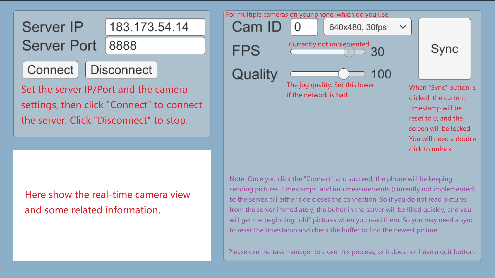

# Phone-Camera

## Phone (Client)

Codes in `Unity/`, Android build in `Build/cam.apk`. I use `unity 2019.4.16f1c1`. The codes read the phone camera and send the picture/timestamp to the server using a socket in real time.

## Windows (Server)

A server in Windows is implemented in `C++/Windows/` using Visual Studio 2019. It contains two projects: `core` for the core lib of the PhoneCamera server and `example` contains a record-video demo. See the example and the comments for the usage. You first need to start the server, then open the cam.apk and connect.

## Linux (Server)

A server in Linux is implemented in `C++/Linux/` using cmake. It is nearly the same as Windows expect for several interfaces (e.g., string port or int port). It has a python wrapper. See example codes for details.

## Update Logs

- *2022.09.14: Add python wrapper for Linux server. Change `isOpen()` to `isOpened()` in Linux codes. Windows codes are not modified.*

